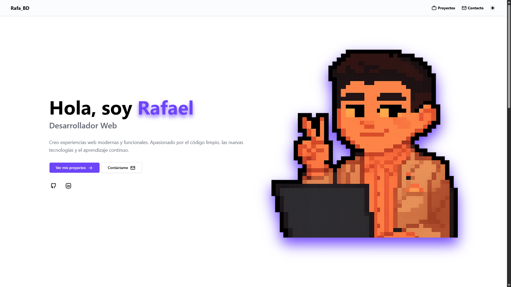

# Portfolio - Rafa BD

---

## 📸 Vista Previa


[🌐 Ver Demo](https://rafaelbd.netlify.app/)

---

## ✨ Características Principales

- 🚀 **Rendimiento Optimizado** - Construcción estática con Astro para carga ultrarrápida
- 🎨 **Diseño Responsivo** - Se ve perfecto en cualquier dispositivo
- 🌙 **Dark Mode** - Toggle tema oscuro/claro integrado
- ⚡ **Animaciones Suaves** - Transiciones fluidas con Tailwind Animations
- 📱 **Mobile First** - Diseñado primero para dispositivos móviles
- 🔍 **SEO Optimizado** - Metaetiquetas y estructura semántica

---

## 🛠️ Stack Tecnológico

### Frontend

- **Astro** - Framework moderno estático
- **Tailwind CSS** - Utilidades CSS para estilos rápidos
- **Tailwind Animations by @Midudev** - Animaciones con tailwind
- **JavaScript** - Lógica interactiva

### Herramientas

- **pnpm** - Gestor de paquetes rápido y eficiente
- **Tailwind Animations** - Animaciones personalizadas de [@midudev](https://tailwind-animations.com/)

---

## 📊 Estadísticas del Proyecto

- ⚡ **Lighthouse Score:** 90+ (Performance), 93+ (Accessibility), 100 (Best Practices), 100 (SEO),
- 📱 **Responsivo:** Mobile, Tablet, Desktop

---

## 📂 Estructura del Proyecto

```
portfolio/
├── src/
├── assets/
│   │   ├── *.svg*           # Iconos SVG
│   ├── components/
│   │   ├── About.astro           # Sección sobre mí
│   │   ├── Contact.astro         # Formulario de contacto
│   │   ├── Footer.astro          # Pie de página
│   │   ├── Hero.astro            # Sección principal
│   │   ├── Navbar.astro          # Barra de navegación
│   │   ├── ThemeToggle.astro    # Toggle tema
│   │   └── projects/
│   │       ├── Projects.astro    # Galería de proyectos
│   │       └── data.js           # Datos de proyectos
│   ├── layouts/
│   │   └── Layout.astro          # Diseño principal
│   ├── pages/
│   │   └── index.astro           # Página de inicio
│   └── styles/
│       └── global.css            # Estilos globales
├── public/                        # Archivos estáticos
├── astro.config.mjs              # Configuración de Astro
└── package.json                  # Dependencias

```

---

## 🚀 Inicio Rápido

### Prerequisitos

- Node.js 18+
- pnpm

### Instalación

1. **Clona el repositorio**

   ```bash
   git clone https://github.com/tuusuario/portfolio.git
   cd portfolio
   ```

2. **Instala las dependencias**

   ```bash
   pnpm install
   ```

3. **Inicia el servidor de desarrollo**

   ```bash
   pnpm run dev
   ```

4. **Abre en tu navegador**
   ```
   http://localhost:3000
   ```

---

## 📦 Scripts Disponibles

```bash
# Inicia servidor de desarrollo
pnpm run dev

# Construye para producción
pnpm run build

# Previsualiza la compilación
pnpm run preview

# Accede a CLI de Astro
pnpm run astro
```

---

## 🤝 Cómo Contribuir

Las contribuciones son bienvenidas. Para cambios grandes:

1. Fork el repositorio
2. Crea una rama para tu feature (`git checkout -b feature/AmazingFeature`)
3. Commit tus cambios (`git commit -m 'Add some AmazingFeature'`)
4. Push a la rama (`git push origin feature/AmazingFeature`)
5. Abre un Pull Request

---

## 📧 Contacto

¿Tienes una idea o quieres colaborar? ¡Me encantaría saber de ti!

- 📧 **Email:** [rafael.benitez.di@usb.edu.mx]()
- 🐙 **GitHub:** [@RafBD](https://github.com/RafBD)
- 🔗 **LinkedIn:** [Rafael Benitez Diaz](https://www.linkedin.com/in/rafael-benitez-diaz/)

---

## 📝 Licencia

Este proyecto está bajo la licencia MIT. Ver el archivo [LICENSE](LICENSE) para más detalles.

---

<div align="center">

**⭐ Si te gusta este proyecto, por favor dale una estrella!**

Hecho con ❤️ por [@RafBD](https://github.com/RafBD)

</div>
