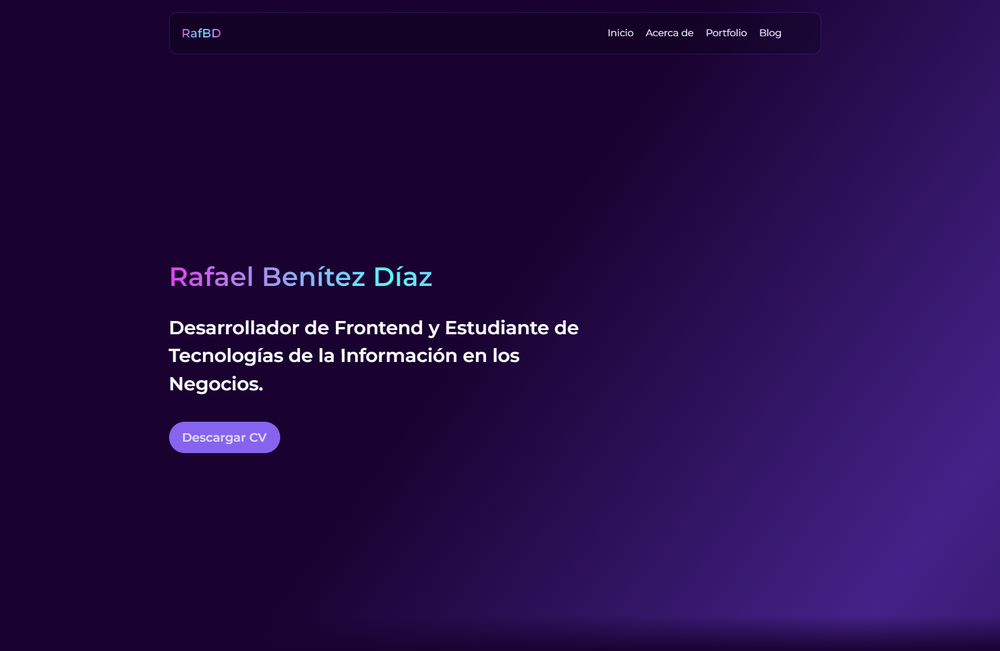

# Mi Portafolio con Astro

¡Bienvenido a mi portafolio! Este proyecto está construido con [Astro](https://astro.build/), un moderno framework para la creación de sitios web rápidos y eficientes. Aquí podrás encontrar una muestra de mi trabajo y habilidades.



> **Nota:** Este proyecto aún está en desarrollo. Algunas características pueden no estar completas y el contenido puede cambiar.

## Características

-   **Rápido y optimizado**: Utilizando la arquitectura de Astro, mi portafolio carga rápidamente y es altamente eficiente.
-   **Diseño moderno**: Un diseño limpio y profesional que destaca mis proyectos y habilidades.
-   **Responsive**: Totalmente adaptable a diferentes dispositivos y tamaños de pantalla.

## Tecnologías Utilizadas

-   **Astro**: Framework principal para la construcción del sitio.
-   **React**: Una biblioteca de JavaScript para crear interfaces de usuario, que permite la creación de componentes reutilizables.
-   **Tailwind CSS**: Preprocesador CSS para mantener los estilos organizados.

## Estructura del Proyecto

```bash
.
├── public
│   ├── assets
│   ├── docs
│   └── img
├── src
│   ├── components
│   ├── content
│   ├── layouts
│   ├── pages
│   ├── styles
│   └── utils
├── .gitignore
└── .prettierrc
├── astro.config.mjs
├── captura-portfolio.png
└── package-lock.json
└── package.json
├── README.md
└── tailwind.config.mjs=
└── tsconfig.json
```

## Instalación y Uso

### Clonar el repositorio

```bash
git clone https://github.com/RafBD/portfolio.git
```

### Instalar las dependencias

```bash
npm i
```

### Abrir en local

```bash
npm run dev
```
